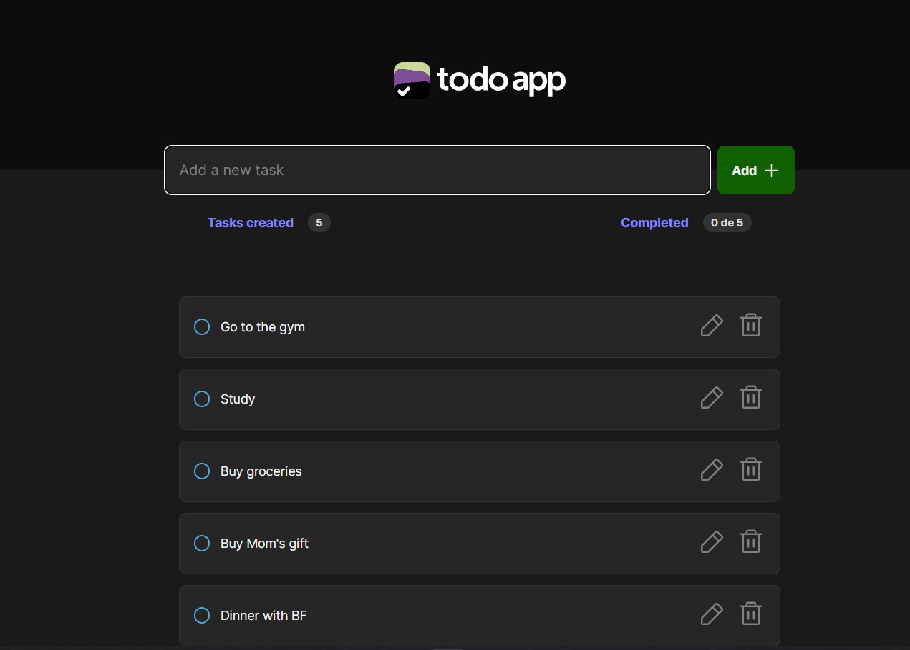

<h1>ToDo App</h1>

<p align="center">
  <a href="#project">Project</a>&nbsp;&nbsp;&nbsp;|&nbsp;&nbsp;&nbsp;
  <a href="#technologies">Tecnologies</a>&nbsp;&nbsp;&nbsp;|&nbsp;&nbsp;&nbsp;
  <a href="#usage">Usage</a>&nbsp;&nbsp;&nbsp;|&nbsp;&nbsp;&nbsp;
  <a href="#license">License</a>
</p>

<p align="center">
  
</p>

<h2 id="project"> Project</h2>

Interactive to-do list application. The project structure follows the Atomic Design methodology, ensuring a scalable and maintainable codebase.<br/>



Atomic Design Principles
The project is organized based on Atomic Design , which divide the UI into five levels of components:

Atoms: Basic, indivisible elements like buttons, inputs, and labels.
Molecules: Simple groups of atoms working together, such as a search form.
Organisms: More complex components composed of molecules and/or atoms, like the task list.
Templates: Page-level wireframes where organisms are arranged to form the structure.
Pages: Specific instances of templates filled with real content.

<h2 id="technologies"> Tecnologies</h2>

- React
- ReactDOM
- TypeScript
- Vite

<h2 id="usage">Usage</h2>

The application is available for use [here](https://todo-list-nayara-torres-projects.vercel.app/).

1. Clone the project:

```
$ git clone https://github.com/torrhes/todo-list.git
```

2. Access the project folder:

```
$ cd todo-list
```

3. Install the dependencies:

```
$ yarn -i
```

4. Inicie o servidor:

```
$ yarn dev
```

<div style="display: flex;">
  <a href="https://www.linkedin.com/in/nayaratorrhes/" target="_blank"></a>
  <a href="mailto:nayaratorrhes@gmail.com"></a>

</div>
